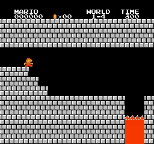
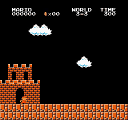
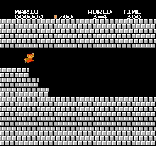
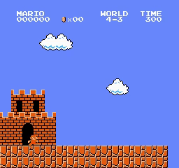
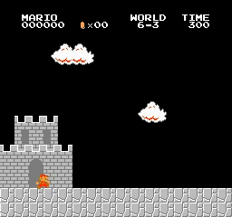
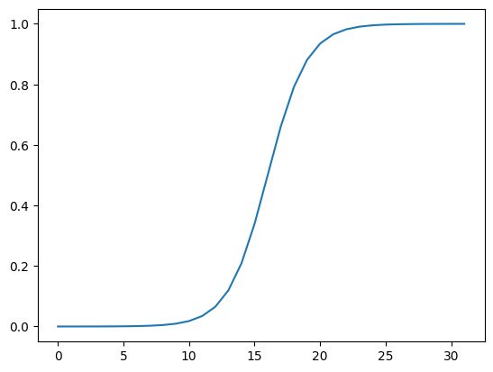
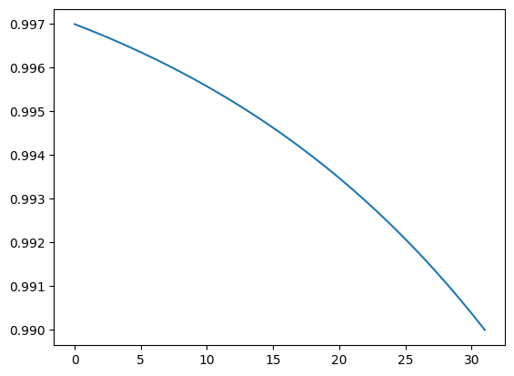

# MARIO_NGU
Playing Super Mario Bros using NEVER GIVE UP (NGU)

## Introduction

My PyTorch NEVER GIVE UP ([NGU](https://arxiv.org/pdf/2002.06038)) implement to playing Super Mario Bros. My implementation use NGU as intrinsic reward and combine it with [PPO](https://arxiv.org/abs/1707.06347) instead of [R2D2](https://openreview.net/pdf?id=r1lyTjAqYX) as original NGU (R2D2 base).

### Terms in NGU

Intrinsic reward of NGU include two terms:
- Term 1: Episodic memory and intrinsic reward (some paper ([RLeXplore](https://arxiv.org/pdf/2405.19548)) call this "pseudo-counts")
- Term 2: Integrating life-long curiosity (just normalize RND reward):
    - Almost RND implement (include original paper) just devide RND output to running std of RND reward or return of RND reward.
    - But NGU subtract running mean and devide by running std.
- I test three versions of NGU intrinsic reward: 
    - 1 policy only pseudo-counts (without RND). Please note that, all method attempts to estimate the number of times a state occurs are called "pseudo-counts". "Pseudo-counts" is not a proprietary name for this algorithm. When referring to "pseudo-counts" in this project, it will by default refer to NGU pseudo-counts.
    - 1 policy NGU (with both pseudo-counts and RND)
    - many policy with NGU (UVFA framework, each actor use different gamma, beta as NGU paper, than each actor have 1 unique policy, only 1 model but with different input (gamma, beta) yeild different policy for each actor) 
- Because:
    - Original paper test three versions!
    - RLeXplore show that full NGU (with RND) maybe poor performance than pseudo-counts (NGU without RND). Please note that we can't sure  RLeXplore show correct analysis because:
        - I don't know RLeXplore use correct hyperparameters and correct implementations because NGU don't have public code!
        - They just test in some envs.
        - They just finetune some hyperparameter set (maybe suboptimal).

### NGU Results

  
  
  
   
  
  
  
   
  
  
  
   
  
  
  
   
  
  
  
   
  
  
  
   
  
  
  
   
  
  
  
   
  <i>NGU Results</i>

## Motivation

Original NGU implement base on R2D2 but I can't find True NGU or even R2D2 available opensource. Almost project just simpler version of NGU or R2D2 (For R2D2, it's not possible to reproduce the Atari results yet. Maybe 256 actors exceeds their budget; keeping the number of actors low will limit R2D2 and NGU). They don't use different epsilon values in epsilon greedy, different gamma and different beta for each actor like NGU paper. Some project maybe implement incorrect or suboptimal make performance of NGU very poor when compare with other intrinsic reward method can easy implement (easy than no bug!) or have reputable opensource.

I read this paper and want to reimplement this to find stronger intrinsic reward can make PPO learn better. Also, I think we need to further evaluate the effectiveness of NGU intrinsic reward in comparison with other algorithms like PPO (original NGU = NGU intrinsic reward + R2D2).

I use Super Mario Bros to test NGU because I can compare NGU with many other algorithms I implemented before. And I still find algorithm that can solve all stages of SMB without finetune hyperparameters. With 1 set of hyperparameters, I will train all stages of SMB with 1 policy (if we need finetune hyperparameters to complete some stages, we can't complete all stages with 1 policy!).

## How to use it

For convenience, I use Jupyter notebooks. There are 3 notebooks for 3 versions of NGU: [NGU_Pseudo_counts_PPO.ipynb](pseudo-counts\NGU_Pseudo_counts_PPO.ipynb), [NGU_one_policy_PPO.ipynb](NGU-one-policy\NGU_one_policy_PPO.ipynb) and [NGU.ipynb](NGU\NGU.ipynb).

You can use my notebook for training and testing agents very easily:
* **Train your model** by running all cells before session test
* **Test your trained model** by running all cells except agent.train(), just pass your model path to agent.load_model(model_path)

You just need to adjust the hyperparameters in the config section.

## Trained models

You can find trained model in folder [pseudo-counts trained_model](pseudo-counts\trained_model), [NGU-one-policy trained_model](NGU-one-policy\trained_model) and [NGU trained_model](NGU\trained_model).

With NGU one policy, I only test stage 8-4 ([8-4.pth](NGU-one-policy\trained_model\8-4.pth) is harder reward system - no add more penalty when Mario die within `info["x_pos"] > 2440 and info["x_pos"] <= 2500`, [8-4-100.pth](NGU-one-policy\trained_model\8-4-100.pth) is eaiser version, increase the penalty to -100 when Mario die within `["x_pos"] > 2440 and info["x_pos"] <= 2500`).

## Hyperparameters

Below is a detailed hyperparameter table for full NGU. You can read more about hyperparameters for pseudo-count and a policy NGU, as well as the hyperparameter finding process, in the Hyperparameter.md files.

I only needed one set of hyperparameters to complete all 32/32 stages. This shows that NGU is better than previous algorithms I've tried (you can find my experiments with **A2C**, **A3C**, **ACKTR**, **PPO**, **LSTM_POO**, **RND**, **DRND**, **PTR_PPO** on my GitHub), which require fine-tuning some special hyperparameters for the more difficult stages (some sets of hyperparameters will only work for some stages and be useless for others).

| Hyperparameters | Value |
| :--- | :--- |
| **num_envs** | 32 |
| **learn_step** | 512 |
| **batchsize** | 256 |
| **epoch** | 10 |
| **lambda** | 0.95 |
| **gamma_min** | 0.99 |
| **gamma_max** | 0.997 |
| **learning_rate** | 7e-5 |
| **target_kl** | 0.05 |
| **clip_param** | 0.2 |
| **max_grad_norm** | 0.5 |
| **update_proportion** | 0.1 |
| **norm_adv** | FALSE |
| **beta_min** | 0 |
| **beta_max** | 1 |
| **V_coef** | 0.5 |
| **entropy_coef** | 0.01 |
| **loss_type** | huber |
| **k** | 10 |
| **kernel_cluster_distance** | 0.008 |
| **kernel_epsilon** | 0.0001|
| **c** | 0.001 |
| **sm** | 8 |

### How to find hyperparameters:
- The hyperparameters for calculating episodic_reward (pseudo-counts reward) are `k = 10, kernel_cluster_distance = 0.008, kernel_epsilon = 0.0001, c = 0.001, and sm = 8`, the same as in the NGU paper.
- `num_envs = 32`, the same as previous projects (note that NGU use 32 policies and 256 envs (256/32=8 env per policy), I only use 1 env for each policy. I can't use 256 envs because this pricing will out of my budget).
- `update_proportion = 0.1`, like RND. Additionally, NGU uses 5/80 frames (the last 5 frames in the 80-frame sequence) to train RND and embedding the model, so update_proportion = 6.25% (I rounded it to 0.1).
- `beta_min, beta_max: 0 and 1`, the same as the NGU paper. `beta` also corresponds to `int_adv_coef` in other projects (I use beta to match the NGU paper). `ext_adv_coef` is fixed to 1.
- `gamma_min, gamma_max: 0.99 and 0.997`, like the NGU paper.
- `entropy_coef = 0.01`: I found 0.01 performed better than 0.05 with the NGU PPO.
- `learn_step = 512, batchsize = 256, lambda = 0.95, epoch = 10, lr = 7e-5, target_kl = 0.05, clip_param = 0.2, max_grad_norm = 0.5, norm_adv = false, V_coef = 0.5`, as in previous projects.

### Policies, gamma and beta

NGU uses 32 independent policies corresponding to 256 environments (instead of using 1 policy like other algorithms). Note: data for a specific policy (collected from its corresponding environment) is only used to train that policy (the NGU paper tried to train using shared data, but it didn't perform as well). Each policy in NGU receives additional gamma and beta parameters as input to the model to predict actions. Below are the gamma and beta graphs for policies 1-32 (similar to the NGU paper):

  <table border="0">
    <tr align="center">
      <td>
        
      </td>
      <td>
        
      </td>
    </tr>
    <tr align="center">
      <td><b>Beta</b></td>
      <td><b>Gamma</b></td>
    </tr>
  </table>

As beta increases, policies prioritize exploration because the intrinsic advantage coefficient is higher. Intrinsic rewards become more important, so the model needs to explore more to increase the total intrinsic reward.

As gamma decreases, policies tend to explore to optimize short-term rewards, as subsequent steps contribute almost nothing due to the small multiplier for gamma.

From 0-31, the higher the env, the more policies prioritize exploration (because the beta coefficient is higher and gamma is lower than the preceding policies). I determined the gamma and beta for each policy as in the NGU paper (see image above).

Similar to NGU, I only used policy 0 to test the results. Note: different models will produce different behavioral sequences; you can experiment further yourself.

## Questions

* Is this code guaranteed to complete the stages if you try training?
  
  - NGU-PPO is good algorithms and I almost win all stages with first run using my hyperparameters. With hard stages like 1-3, 5-3 and 8-4, maybe you need run 1-3 times to complete this stages. With my knowledge and experience, NGU-PPO have higher completion rate than PTR-PPO, RND-PPO, DRND-PPO, PPO, A2C, A3C, ACKTR.

* How long do you train agents?
  
  - Within a few hours to more than 1 day. Time depends on hardware, I use many different hardware so time will not be accurate.

* How can you improve this code?
  
  - You can separate the test agent part into a separate thread or process. I'm not good at multi-threaded programming so I don't do this.
  - You can tuning hyperparameters.
  - You can apply new network architectures (like attention, Resnet), maybe it work?
  - Try to improve R2D2 implement (especially when there are multiple machines or servers because R2D2 is designed to run in parallel on multiple servers instead of 1 machine like the way I implemented PPO).
 
* Num environments, num policies?

  - NGU separates num policies (N=32) and num envs (256). This means 8 envs for 1 policy. They also distribute training across many different computers, so it's very fast. I can't set num envs = 256 because it's too slow and exceeds the budget.
  - The original NGU uses R2D2. From what I understand, setting num actors to 256 prevents the model from overfitting in the replay buffer (actors push data in very quickly). This might not seriously affect PPO because it's online learning (although 256 might actually perform better than 32?).

## Discussion

* About normalizing intrinsic reward

    - I use min-max scaling because, with previous algorithms, it has performed more effectively than dividing by the running standard deviation.
    - For RND reward, I subtract the running mean and divide by the running standard deviation as NGU paper (though the paper does not explain this clearly or provide alternative experiments).

* Challenges

    - I can't find True NGU implementations.
    - Certain formulas, such as calculating the moving average $d_m$, are not explicitly detailed in the paper.
    - Methods for normalizing rewards have not been thoroughly researched; it is possible that each intrinsic reward is better suited to a specific normalization method.

## Requirements

* **python 3>3.6**
* **gym==0.25.2**
* **gym-super-mario-bros==7.4.0**
* **imageio**
* **imageio-ffmpeg**
* **cv2**
* **pytorch** 
* **numpy**

## Acknowledgements
With my code, I can completed all 32/32 stages of Super Mario Bros. 

## Reference

* [NGU paper](https://arxiv.org/pdf/2002.06038)
* [PPO paper](https://arxiv.org/abs/1707.06347)
* [Coac NGU](https://github.com/Coac/never-give-up/tree/main)
* [CVHvn PPO](https://github.com/CVHvn/Mario_PPO)
* [Stable-baseline3 PPO](https://stable-baselines3.readthedocs.io/en/master/_modules/stable_baselines3/ppo/ppo.html#PPO)
* [lazyprogrammer A2C](https://github.com/lazyprogrammer/machine_learning_examples/tree/master/rl3/a2c)
* [jcwleo RND](https://github.com/jcwleo/random-network-distillation-pytorch/blob/master/utils.py)
* [DI-engine RND](https://opendilab.github.io/DI-engine/12_policies/rnd.html)
* [vwxyzjn cleanrl/ppo_rnd_envpool.py](https://github.com/vwxyzjn/cleanrl/blob/master/cleanrl/ppo_rnd_envpool.py)
